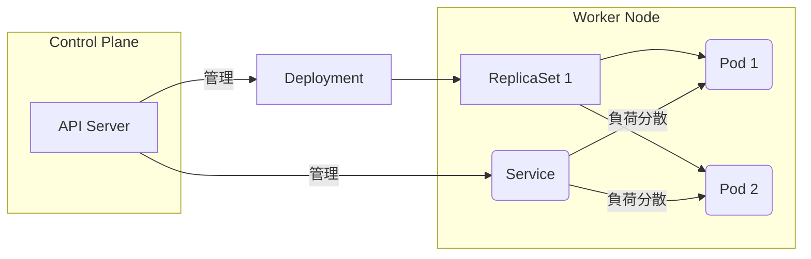

# Kubernetesの基本構成要素
このドキュメントは、コンテナオーケストレーションシステムであるKubernetes (K8s) を構成する主要なオブジェクトと、それらの関係について説明します。

---
## 1. 概要
- **目的**: 多数のコンテナ化されたアプリケーションのデプロイ、スケーリング、管理を自動化する。
- **構造**: **コントロールプレーン**（管理機能）と**ノード**（作業を担うマシン）で構成される。

---
## 2. 主要なワークロードオブジェクト
| オブジェクト | 役割 | 目的 |
|---|---|---|
| **Pod** | K8sにおける**最小のデプロイ可能単位**。1つ以上のコンテナの集まり。 | コンテナをグループ化し、同じネットワークとストレージを共有させる。 |
| **Deployment** | **Pod**と**ReplicaSet**を管理する。宣言的な更新を提供する。 | アプリケーションのDesired State（望ましい状態）を定義し、ローリングアップデートなどを可能にする。 |
| **Service** | Podの論理的なセットを定義し、それらにアクセスするための**安定したIPアドレス**とDNS名を提供する。 | 負荷分散とサービスディスカバリ（サービス発見）を実現する。 |
| **Volume** | Pod内のコンテナ間で共有されるストレージ。 | データ永続化の仕組みを提供する。 |

---
## 3. Kubernetesオブジェクトの関係図
Pod、Deployment、Serviceの連携関係を図示します。

