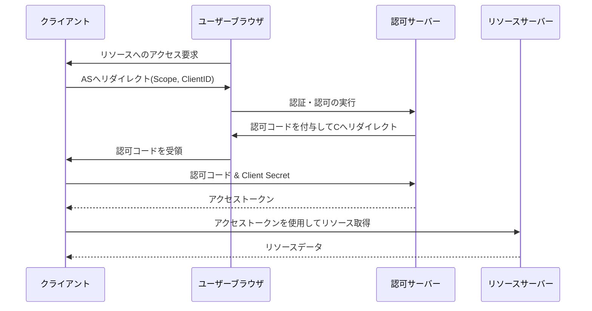

# OAuth 2.0 認証フロー (Authorization Code Grant)
このドキュメントは、サードパーティアプリケーションがユーザーの代わりにリソースにアクセスするための標準的なフレームワークであるOAuth 2.0の「Authorization Code Grant」フローを解説します。

---
## 1. 概要
- **目的**: ユーザー名とパスワードを**サードパーティ（クライアント）に渡すことなく**、リソースサーバーへのアクセス権（アクセストークン）を付与する。
- **安全性**: 最も一般的に使用され、セキュリティが高いフロー。

---
## 2. フローの主要ステップ
| ステップ | 動作 | 主な役割 |
|---|---|---|
| **1. 認可リクエスト** | クライアントがユーザーを認可サーバーへリダイレクトする。 | クライアント、ユーザー |
| **2. 認可コード取得** | ユーザーが認証・認可した後、認可サーバーがクライアントへ**認可コード**を発行する。 | 認可サーバー |
| **3. トークン交換** | クライアントが**認可コード**と**クライアントシークレット**を認可サーバーに送信する。 | クライアント |
| **4. トークン発行** | 認可サーバーが**アクセストークン**（とリフレッシュトークン）を発行する。 | 認可サーバー |
| **5. リソースアクセス** | クライアントが**アクセストークン**を使ってリソースサーバーにアクセスする。 | クライアント、リソースサーバー |

---
## 3. Authorization Code Grant シーケンス図
クライアント、認可サーバー、リソースサーバー間の連携を図示します。

