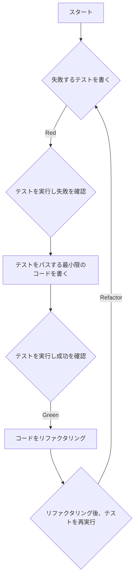

# TDD（テスト駆動開発）の基本原則
このドキュメントは、TDD（Test-Driven Development）の概念、基本的なサイクル、およびそのメリットを説明します。

---
## 1. 概要
- **目的**: **失敗するテストを最初に書く**ことから始め、テストをパスするための最小限のコードを実装することで、高品質なコードを短期間で開発する。
- **提唱者**: Kent Beck。

---
## 2. TDDの3ステップサイクル
TDDは「Red-Green-Refactor」という短いサイクルを繰り返します。

### ✅ 1. Red (赤)
- **行動**: 実装したい機能を満たさない**失敗するテスト**を書く。
- **目的**: 新しい機能や振る舞いを明確に定義する。

### ✅ 2. Green (緑)
- **行動**: 書いたテストを**パスするだけの最小限のプロダクションコード**を書く。
- **目的**: 機能要件を満たすこと（一時的にコード品質は無視してもよい）。

### ✅ 3. Refactor (リファクタリング)
- **行動**: すべてのテストがパスしている状態を維持しながら、コードの**重複を排除し、構造を改善**する。
- **目的**: 既存の振る舞いを変更せずに、コードをより清潔で理解しやすいものにする。

---
## 3. TDDのサイクル図
TDDの継続的な開発サイクルをシーケンス図で示します。

