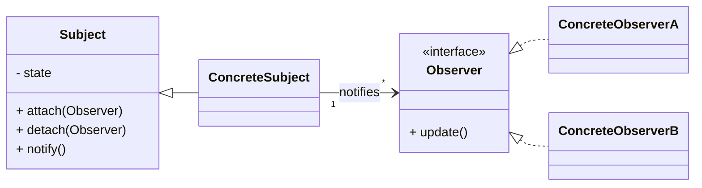

# ソフトウェア設計パターン：オブザーバー
このドキュメントは、GoFデザインパターンの一つであるオブザーバーパターンの定義、目的、および構成要素を解説します。

---
## 1. 概要
- **目的**: あるオブジェクト（**Subject/発行者**）の状態が変化したとき、それに依存するすべてのオブジェクト（**Observer/購読者**）に自動的に通知されるように、**一対多の依存関係**を定義する。
- **利点**: SubjectとObserverが**疎結合**になり、それぞれ独立して変更や再利用が可能になる（イベント駆動システムの基本）。

---
## 2. 構成要素
| 要素 | 役割 | 説明 |
|---|---|---|
| **Subject** | 状態を保持し、変更を通知する**発行者**のインターフェース。 | Observerの**登録・解除**メソッドを持つ。 |
| **ConcreteSubject** | 具体的な状態変化を持ち、**通知を発行**するクラス。 | 状態が変化した際に、登録されたすべてのObserverに通知する。 |
| **Observer** | Subjectからの通知を受け取るための**購読者**のインターフェース。 | `update()`などの通知受け取りメソッドを定義する。 |
| **ConcreteObserver** | Observerインターフェースを実装し、通知に応じて**具体的な処理**を行うクラス。 | 通知を受け取り、Subjectの状態を取得・利用して独自の処理を実行する。 |

---
## 3. オブザーバーパターンのクラス図

