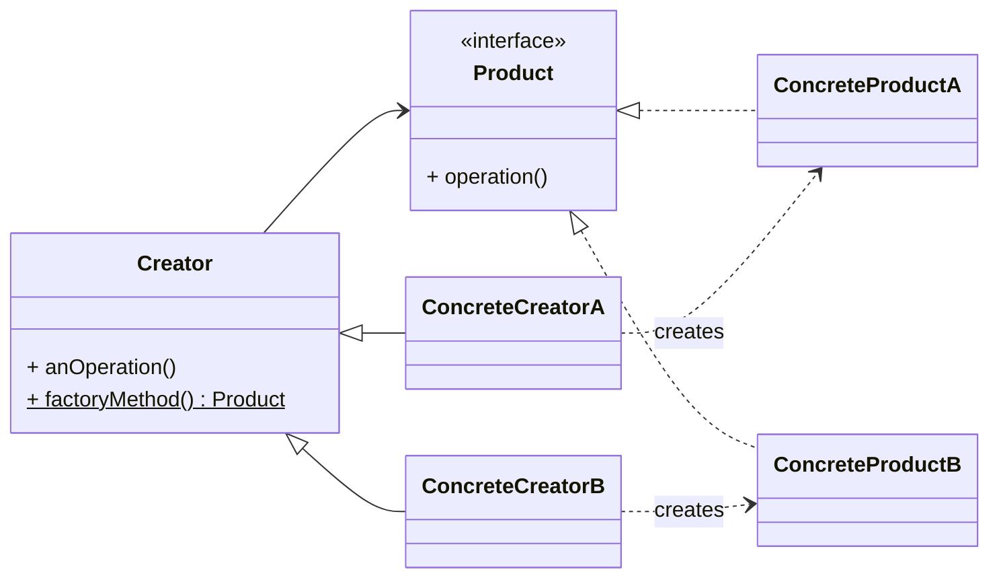

# ソフトウェア設計パターン：ファクトリメソッド
このドキュメントは、GoFデザインパターンの一つであるファクトリメソッドパターンの定義、目的、および実装の構成要素を解説します。

---
## 1. 概要
- **目的**: オブジェクトの生成処理を**サブクラスに委譲**することで、**生成する具体的なクラスを意識せず**にオブジェクトを利用可能にする。
- **分類**: 生成に関するパターン（Creational Pattern）。
- **利点**: クラスの生成と利用を分離するため、新しい製品クラスを追加しても既存のクライアントコードを変更する必要がない（**OCP**: 開放/閉鎖原則に適合）。

---
## 2. 構成要素
ファクトリメソッドパターンは主に以下の4つの構成要素で成り立ちます。

| 要素 | 役割 | 説明 |
|---|---|---|
| **Product** | 生成されるオブジェクトが満たすべき**インターフェース**または抽象クラス。 | すべての製品クラスが実装すべき共通のメソッドを定義する。 |
| **ConcreteProduct** | Productインターフェースを実装する**具体的な製品クラス**。 | 実際に生成されるオブジェクト。 |
| **Creator** | ConcreteProductを生成する**抽象ファクトリクラス**。 | 製品を生成するための**ファクトリメソッド**（抽象メソッド）を定義する。 |
| **ConcreteCreator** | Creatorを継承し、**具体的なファクトリメソッドを実装**するクラス。 | どのConcreteProductを生成するかを決定する。 |

---
## 3. ファクトリメソッドのクラス図
このパターンの構造をUMLクラス図で示します。

