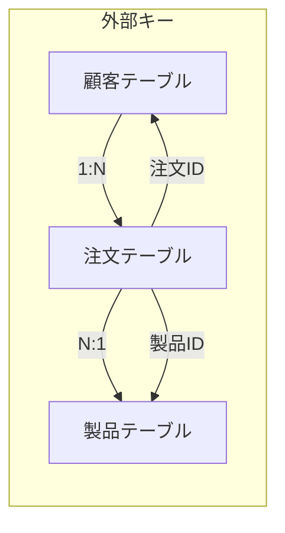

# データベーススキーマの正規化
このドキュメントは、データベース設計における正規化の基本原則と適用について説明します。

---
## 1. 概要
- **目的**: データの**冗長性を排除**し、**整合性を維持**すること。
- **対象**: RDBのテーブル設計、データモデルの改善。

---
## 2. 正規化の段階
### ✅ 第一正規形 (1NF)
- **原則**: 繰り返し項目を排除し、すべての列が**単一値**を持つこと。
- リスト形式や複数の値を持つ属性は、別テーブルまたは行に分割します。

### ✅ 第二正規形 (2NF)
- **原則**: 1NFを満たし、非主キー属性が**主キーの全体**に従属していること。
- 部分関数従属があれば、別テーブルに分割します。

### ✅ 第三正規形 (3NF)
- **原則**: 2NFを満たし、非主キー属性間で**推移的関数従属**がないこと。
- 非主キー属性が別の非主キー属性に依存している場合、それらを別テーブルに分割します。
**ほとんどのアプリケーションでは3NFまでで十分です**

---
## 3. 正規化のメリットとデメリット

| 項目 | メリット | デメリット |
|---|---|---|
| データの整合性 | 高い。更新異常が起こりにくい。 | 高い。テーブル結合（JOIN）が増える。 |
| 冗長性 | 低い。記憶領域の節約になる。 | 低い。複雑なクエリが必要になる。 |

---
## 4. テーブル連携の例 (3NF)
顧客、注文、製品の基本的なリレーションシップを図示します。

