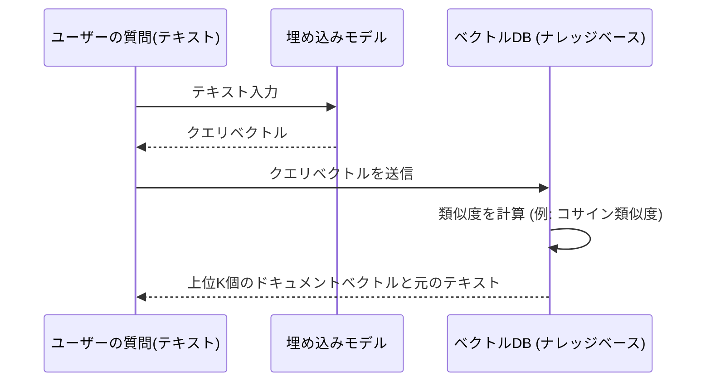

# ベクトル検索の基礎と評価指標
このドキュメントは、RAGシステムの核となるベクトル検索（類似検索）の仕組みと、その性能を評価するための主要な指標を説明します。

---
## 1. ベクトル検索の概要
- **目的**: テキスト、画像、音声などの非構造化データを**ベクトル（数値のリスト）**に変換し、**意味的な類似性**に基づいて検索する。
- **メカニズム**: クエリベクトルとナレッジベース内のドキュメントベクトルとの間の**距離を計算**し、距離が近いものを類似度が高いと判断する。

### ✅ 主な距離測定方法
| 測定方法 | 特徴 | 適用シーン |
|---|---|---|
| **コサイン類似度** (Cosine Similarity) | ベクトルの方向の類似度を測定。長さ（規模）の影響を受けにくい。 | テキストやドキュメント検索で最も一般的。 |
| **ユークリッド距離** (Euclidean Distance) | ベクトル間の幾何学的な直線距離を測定。 | 空間的な近さが重要な場合。 |

---
## 2. ベクトル検索の実行フロー
ユーザーの質問がどのようにベクトルDBで処理されるかの概念図です。

