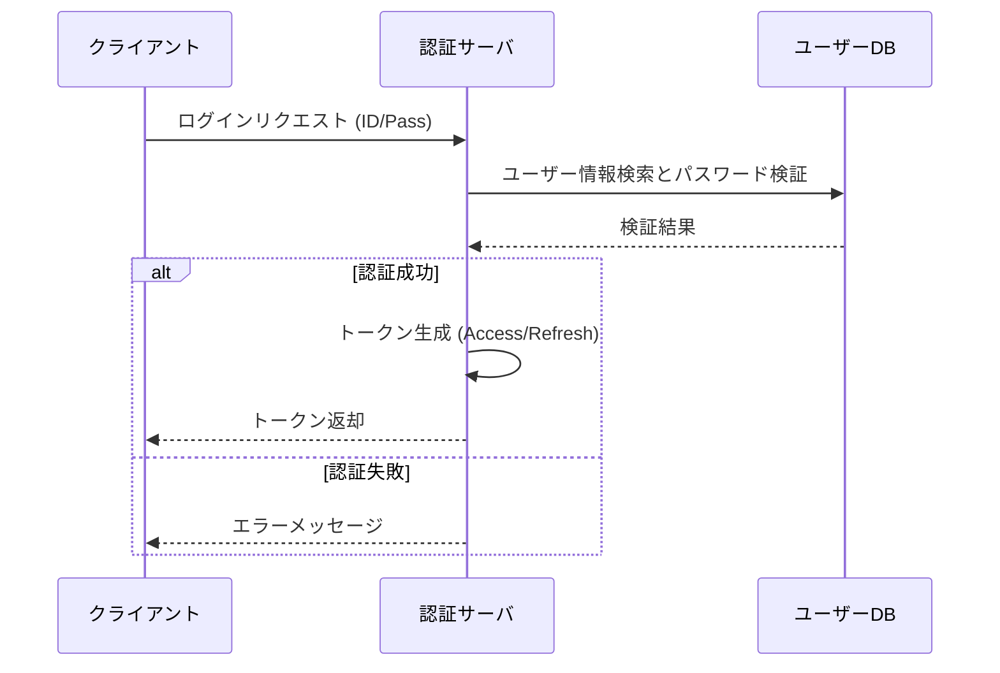

# ユーザー認証フロー
このドキュメントは、当社のウェブサービスにおける標準的なユーザー認証フローを定義します。

---
## 1. 概要
- **目的**: ユーザーのセキュアな識別とアクセス許可の付与。
- **対象**: フロントエンドアプリケーション、認証サーバー、ユーザーデータベース。

---
## 2. 認証手順
### ✅ ログイン手順
ログインは以下の手順で進行します。

1. ユーザーは**ID**と**パスワード**を入力し、クライアントからリクエストを送信。
2. 認証サーバーは受信した認証情報を検証。
3. 検証成功後、**アクセストークン**と**リフレッシュトークン**を発行。
4. クライアントはトークンを保存し、以降のAPIリクエストに使用。
**トークンはセキュアな方法で保存**

### ✅ トークンの種類と用途
| トークン | 有効期限 | 用途 |
|---|---|---|
| アクセストークン | 短い（例：15分） | APIへのアクセス |
| リフレッシュトークン | 長い（例：7日） | アクセストークンの再発行 |

---
## 3. シーケンス図
以下のMermaid図は、ログイン時の詳細なシーケンスを示します。

