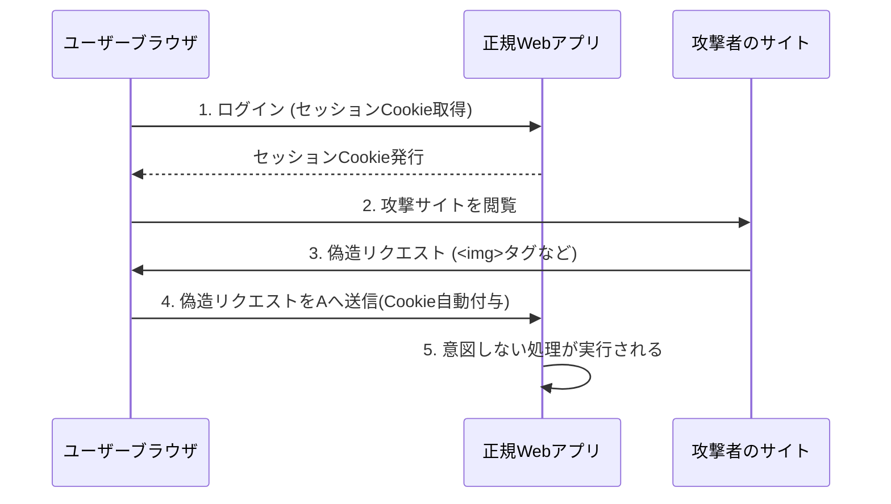

# 主要なWebセキュリティ脆弱性 (XSSとCSRF) の対策
このドキュメントは、Webアプリケーションで一般的で危険な脆弱性であるクロスサイトスクリプティング（**XSS**）とクロスサイトリクエストフォージェリ（**CSRF**）のメカニズムと、それらの効果的な対策を説明します。

---
## 1. XSS (Cross-Site Scripting)
- **概要**: 攻撃者が悪意のあるスクリプトをWebページに埋め込み、それを閲覧したユーザーのブラウザで実行させる。

| XSSの種類 | 攻撃の持続性 | 対策のポイント |
|---|---|---|
| **Reflected XSS** | 一時的 | 出力時の**エスケープ処理**（HTML特殊文字を無害化）。 |
| **Stored XSS** | 永続的 | サーバーに保存されるデータに対する**入力のサニタイズ**。 |

### ✅ XSSの最も基本的な対策
- ユーザー入力やデータベースから取得したデータをHTMLとして表示する際は、必ず**適切なエスケープ処理**を行う。

---
## 2. CSRF (Cross-Site Request Forgery)
- **概要**: ログイン済みのユーザーを騙して、意図しないリクエストを**攻撃者が用意したWebサイトから**正規のWebアプリケーションに送信させる。

### ✅ CSRFの基本的な対策
- **トークン検証**: リクエストごとにランダムな**CSRFトークン**を発行し、サーバー側で検証する。
- **SameSite Cookie属性**: Cookieの送信を同一サイトに限定する。
- **Origin/Refererヘッダー検証**: リクエスト元が許可されたドメインであることを確認する。

## 3. CSRFの概念図
攻撃者がどのようにしてユーザーのリクエストを偽造するかの概念図です。

