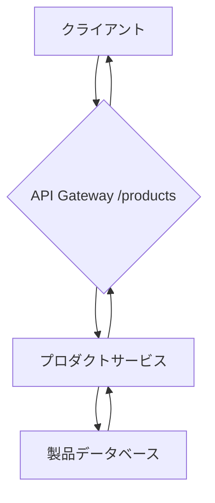

# 製品リスト取得API
このドキュメントは、製品一覧を取得するための新しいAPIエンドポイントの仕様を記述します。

---
## 1. 概要
- **目的**: データベースからカテゴリ別の製品リストをJSON形式で取得する。
- **エンドポイント**: `/api/v1/products`
- **メソッド**: `GET`

---
## 2. リクエストとレスポンス
### ✅ リクエストパラメータ
- リクエストは以下のパラメータをサポートします。

| パラメータ | 必須/任意 | 型 | 説明 |
|---|---|---|---|
| `category` | 必須 | String | 取得したい製品のカテゴリ名 |
| `limit` | 任意 | Integer | 取得件数の上限 (デフォルト: 10) |
| `sort_by` | 任意 | String | ソートキー (例: `price`, `name`) |

### ✅ レスポンスの構造
- 成功時のHTTPステータスコードは**200 OK**です。
- 1段落は1つの意味に集中。
- 応答データは、`data`配列内に製品オブジェクトのリストを含みます。
- 各製品オブジェクトには、`id`, `name`, `price`, `stock`が含まれます。

---
## 3. システム連携フロー
APIが製品データを提供する際の基本的な内部フローを示します。

