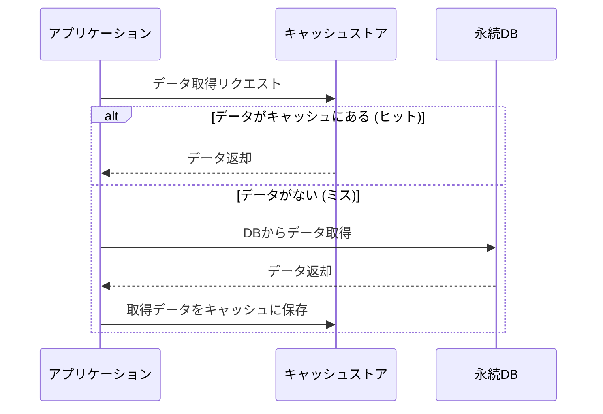

# アプリケーションのキャッシュ戦略
このドキュメントは、システム全体のパフォーマンスを向上させるためのキャッシュ戦略を選定します。

---
## 1. 概要
- **目的**: データアクセスの**レイテンシを短縮**し、バックエンドDBの**負荷を軽減**する。
- **場所**: クライアントサイド、CDN、リバースプロキシ、アプリケーション層。

---
## 2. キャッシュタイプ
### ✅ Write-Through (ライトスルー)
1. データを**キャッシュ**と**永続ストア**の両方に同時に書き込む。
2. データの一貫性が保たれやすい。

### ✅ Write-Back (ライトバック)
1. データを**キャッシュのみ**に書き込む。
2. 一定時間後、または満杯になったときに永続ストアに書き込む。
3. **書き込み性能は速いが**、キャッシュ障害時にデータ損失のリスクがある。

### ✅ Cache-Aside (キャッシュ・アサイド)
1. アプリケーションが**キャッシュを直接管理**する。
2. 読み込み時、まずキャッシュを確認し、なければDBから取得しキャッシュに保存する。

---
## 3. キャッシュ戦略選定フロー
アプリケーション層におけるデータ取得フローの例です。

