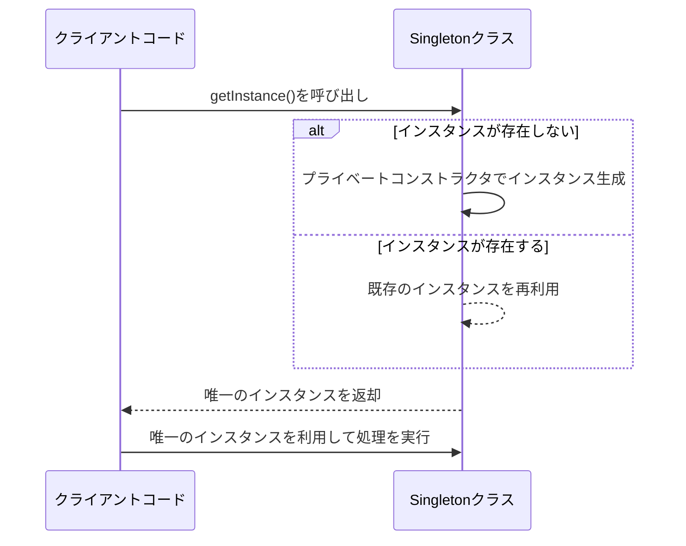

# ソフトウェア設計パターン：シングルトン
このドキュメントは、GoFデザインパターンの一つであるシングルトンパターンの定義、目的、および実装時の考慮事項を解説します。

---
## 1. 概要
- **目的**: あるクラスのインスタンスが**ただ一つ**しか存在しないことを保証し、そのインスタンスへの**グローバルなアクセスポイント**を提供する。
- **適用シーン**: ログ出力、設定管理、データベース接続プールなど。

---
## 2. 実装のポイント
### ✅ 構造
- **プライベートなコンストラクタ**: 外部からの直接的なインスタンス化を防ぐ。
- **静的なインスタンス**: クラス内に唯一のインスタンスを保持する。
- **静的なファクトリメソッド**: 唯一のインスタンスを取得するための公開メソッド。

### ✅ スレッドセーフティの確保
- マルチスレッド環境では、複数のスレッドが同時にインスタンスを作成しようとする競合状態を避けるため、**スレッドセーフな実装**が必須。
- **ダブルチェックロック**や、言語組み込みの初期化機構を利用することが推奨される。

---
## 3. シングルトンパターンのフロー
シングルトンインスタンスが生成・利用される基本的なシーケンス図です。

